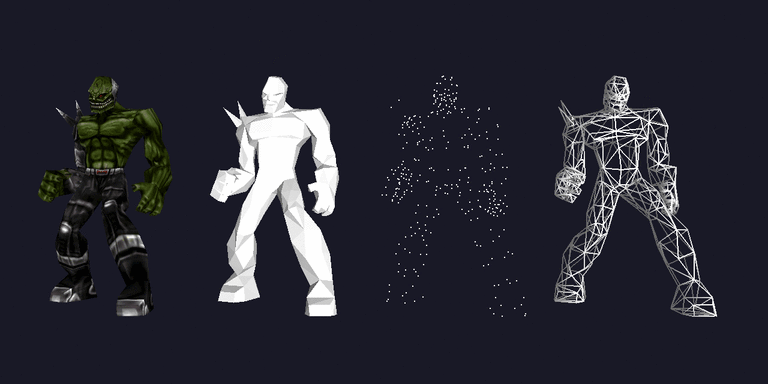

# libmd2.c
outdated, deprecated work from 2005
C functions to load Quake II MD2 model files and render them using OpenGL, GPL Version 3, see [README](README)

For demonstration purposes the model/ folder contains the model "Ratamahatta" https://www.thingiverse.com/thing:3429029 by VIErus https://www.thingiverse.com/VIErus - CC-BY http://creativecommons.org/licenses/by/3.0/
